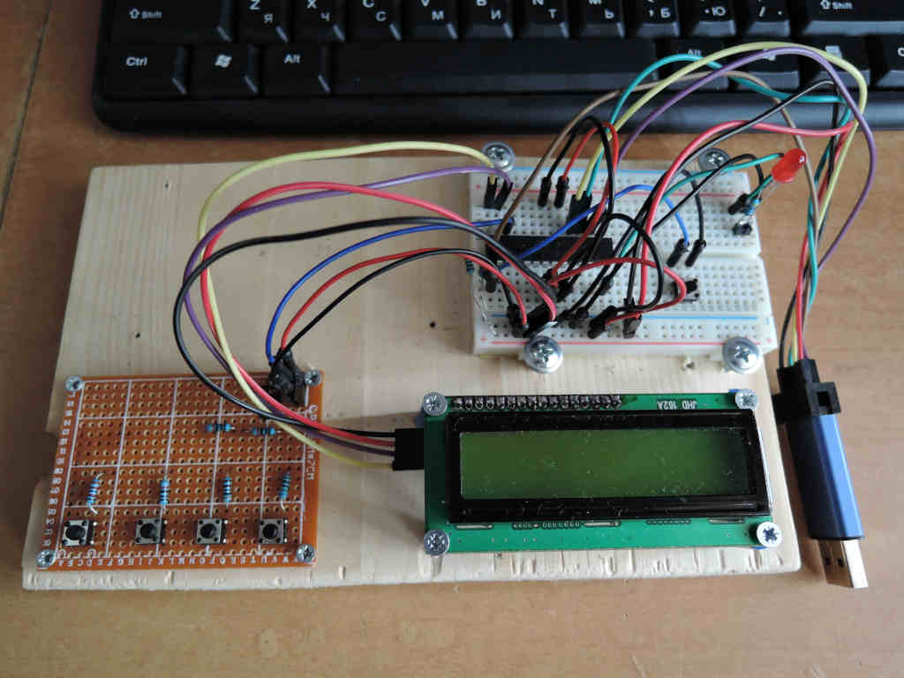

# adc_buttons_pad
ATmega8. Add 4 switches and voltage divider to my previously built repo HD44780_PCF8574A 

Testing wired model before doing a PCB variant of authonomous HVPP programmer is the third goal. 
Understanding of popular avr microcontroller and not popular avr-gcc assembler - the second one 
To get more skills, knowledges and fun is the first. You should know 

(Well, I am not english speaking man, so please forgive me my weird style)

